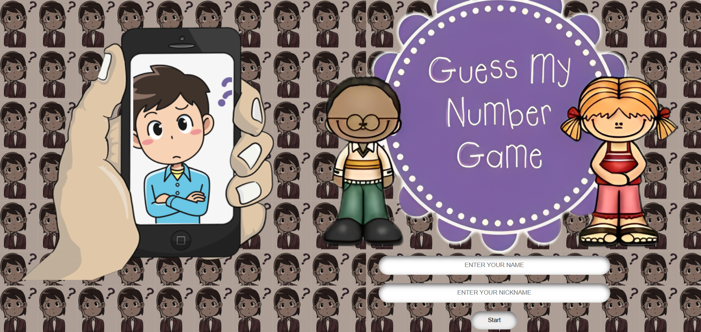
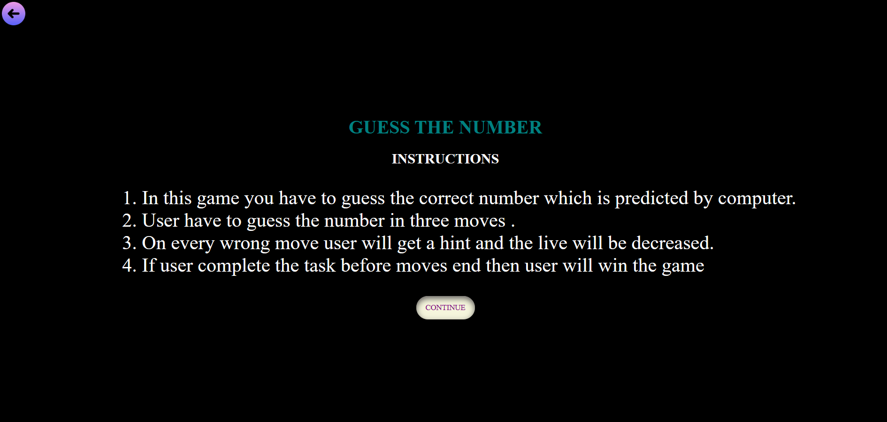
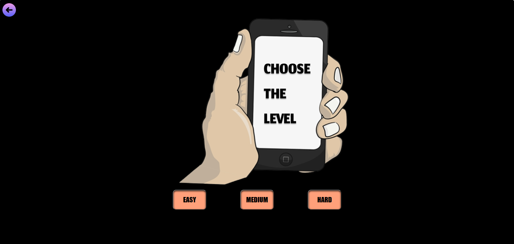
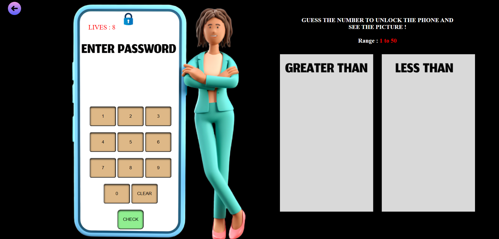
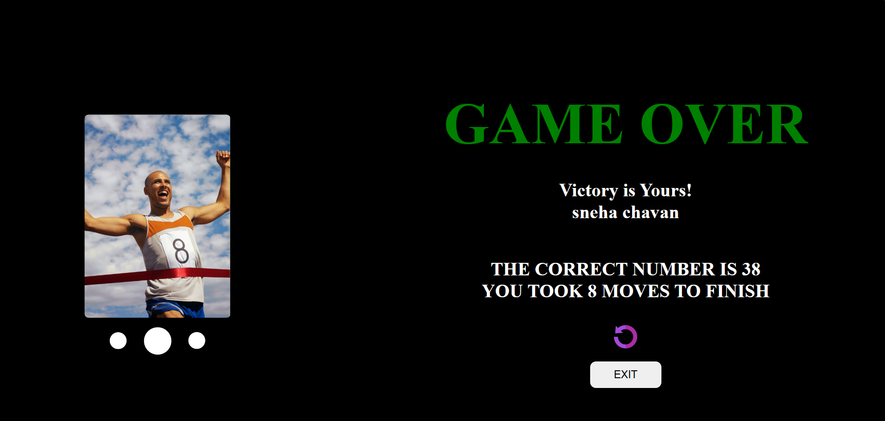
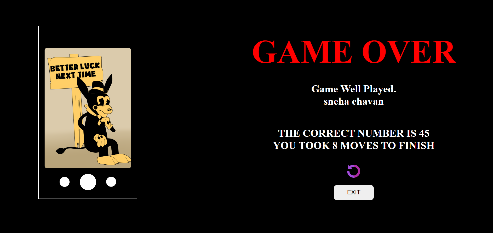

# Guess-the-number-game 

Game link : https://frolicking-arithmetic-a5be45.netlify.app/

# Game Idea :
The idea of the game is  user have to guess the number which is given by the computer.

# How to play :
1. On the very first page you have to enter your name and the nickname , and click on the start button.
2. Then instruction page is opened user have to read the instruction to know how to play the game and click the continue button.
3. Then the third page arrived . On third page you have to select the levels among the easy,medium,and hard .
4. Fourth page is the main game page in my this game basically you have to guess the number which is given by the computer  in given lives . When you give wrong answer you will get hint . 
5. If you give the correct answer you will win the game  or if you  can't give the correct answer you will lose the game .
6. After that you you will jump on the next page which is the last page which shows in how many moves you complete the game or you win or lose the game. 

# Tech stack used to make game : HTML , CSS , JAVASCRIPT.

# screens in the game 
1. first page :

2. Instruction page :

3. Third page where we have to choose level :

4.  main page : 

5. winner page :

6. loser page :

# Reference :

1. I took icons from https://www.flaticon.com/search?word=REPLAY&color=color.
2. sound effect and images  from https://pixabay.com.
3. 